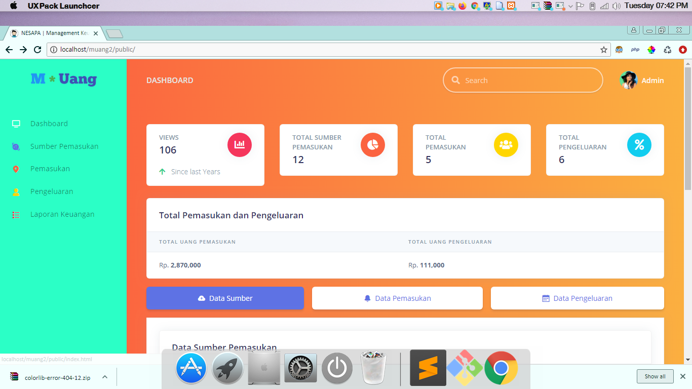
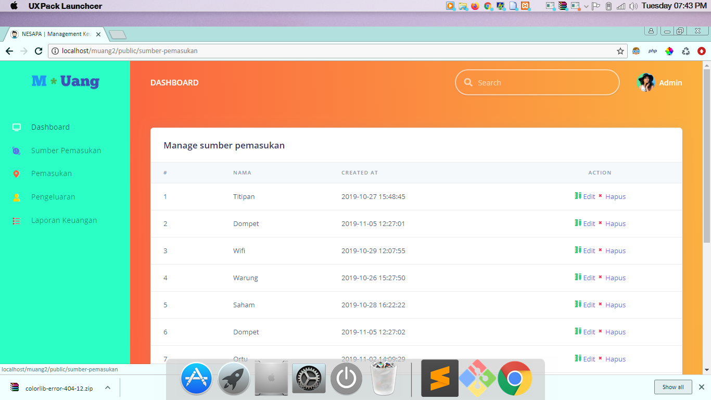
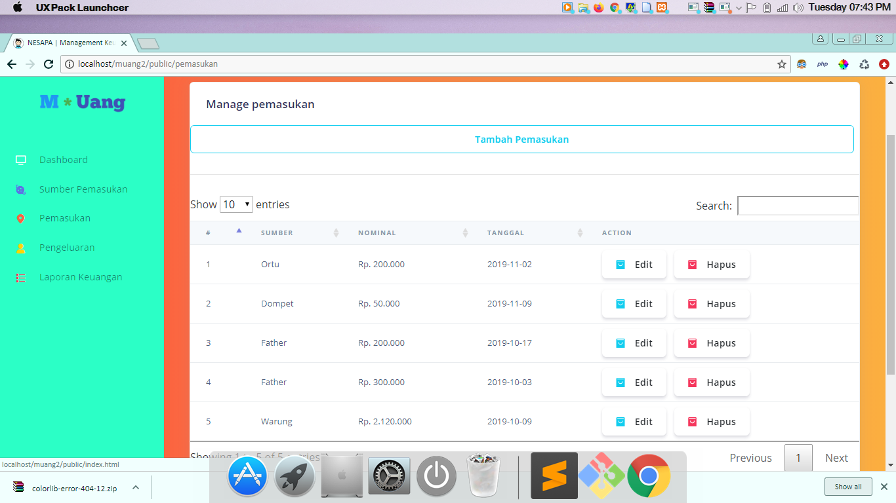
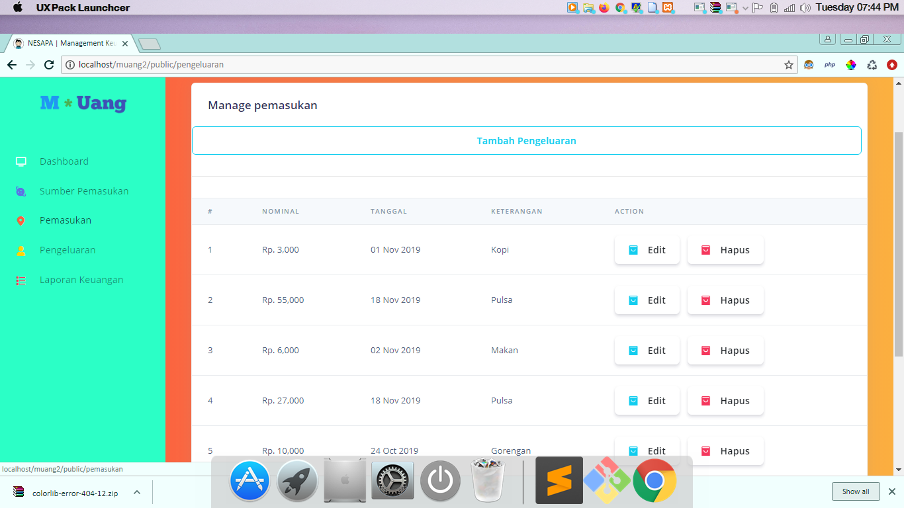

# m-uang

m-uang is a personal bookkeeping web application, built with Laravel 5.

## Objective
Easy bookkeeping for personal income and spending (amount of money).

## Concept

To aquire our objective, we need this features on the application:

- Admin can access all fiture.
- Admin can add, edit and delete sumber.
- Admin can add, edit and delete pemasukan details.
- Admin can add, edit and delete pengeluaran datails.
- Admin can view all sumber, pemasukan, and pengeluaran on dashboard.
- etc.

Those are basic concept of the personal bookkeeping service.

## Getting Started
This application can be installed on local server and online server with these specifications :

#### Server Requirements
1. PHP 7.2 (and meet [Laravel 5.x server requirements](https://laravel.com/docs/6.x#server-requirements)),
2. MySQL or MariaDB database,
3. SQlite (for automated testing).

#### Installation Steps

1. Clone the repo : `git clone https://github.com/ibnusyawall/m-uang.git`
2. `$ cd m-uang`
3. `$ composer install`
4. `$ cp .env.example .env`
5. `$ php artisan key:generate`
6. Create new MySQL database for this application  
(with simple command: `$ mysqladmin -urootuser -p create dompet_db`)
7. Set database credentials on `.env` file
8. `$ php artisan migrate`
9. `$ php artisan serve`
10. set url to : setup, example : localhost/setup, to setup admin login
11. Default Login : email: admin@localhost.com | password : admin

## Contributing

If you are considering to contribute to this repo. It is really nice.

1. Submit Issue if you found any errors or bugs or if you want to propose new feature.
2. Pull Request for bugfix, typo on labels, or new feature.

## Screenshots

#### Dashboard

#### Sumber Pemasukan

#### Pemasukan

#### Pengeluaran

## License

m-uang is a free and open-sourced software under [MIT License](LICENSE).